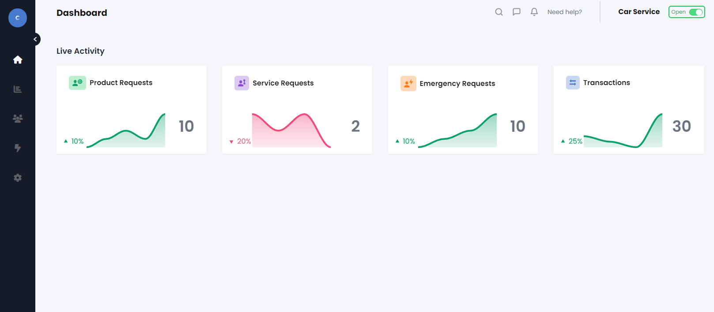

<!-- PROJECT LOGO -->
 

  

  <h3 align="center">Modern Dashboard Template</h3>

  

    This is a stylish visual dashboard prototype from Figma, being realised into a modern website
     
    <a href="https://demo.z3ntl3.com"><strong>View Live Demo</strong></a>
     

  

---
### Built using
- Tailwindcss
- Alpine.js
- AnimXYZ
- ApexCharts

### Local web server
- Caddy (aka Caddy server)
> Please note, this is a vanilla web template, you can implement it with anything.

---
### Credits
- z3ntl3 
  > Realising the template and turning it into a modern website

- [Figma](https://www.figma.com/design/Dpip8SQS7jPZ3h9LchM6Da/Carvice---A-Car-service-vendor-dashboard-UI-kit-(Community)?node-id=1-388&t=4UsAvSNsME8J3j48-0)
  > The visual prototype used to build this website.